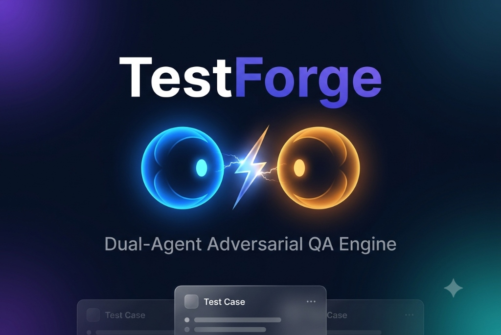

# TestForge

### Two AI agents argue with each other so your test cases don't have gaps.

**[🌐 Try Live Demo](https://testforgev5.onrender.com)** •
**[▶ Watch Demo](https://youtu.be/jEZ7qNo6ORk?si=OO7Q8yOzPNdrypZC)** •
**[📋 Hackathon](https://uipath-agenthack.devpost.com)**

<div align="center">



[](LICENSE)
[]()
[]()
[](https://testforgev5.onrender.com)

</div>

---

## What is TestForge?

TestForge is an adversarial AI-powered test case generator built for
**UiPath AgentHack 2026 — Track 3: Agentic Software Testing in Test Cloud**.

Most AI test tools work like this: one AI writes test cases, you trust
it blindly, done. The problem is it always misses something — edge
cases, security gaps, ambiguous requirements that nobody checked.

TestForge fixes that by running **two independent Gemini 3.5 Flash
agents in a structured debate loop** before you ever see a result:

- **Builder Agent** drafts the initial test suite from your requirement
- **Skeptic Agent** independently tears it apart — finding missing
  scenarios, ambiguous coverage, and security gaps the Builder missed
- **Builder Agent** responds to every single critique — fixing or
  defending each one with a clear justification

The final, debated test cases sync directly into **UiPath Test Manager
(Test Cloud)**. The full debate transcript is preserved as an audit
trail so teams can see exactly what was caught and why.

**Business problem solved:** QA teams spend the majority of their time
manually writing test cases and still miss edge cases. TestForge
eliminates manual writing entirely while producing more thorough results
than a single-pass AI tool — because every output has already been
reviewed and defended before the user sees it.

---

## Live Demo

🌐 **[testforgev5.onrender.com](https://testforgev5.onrender.com)**

▶ **[Watch full demo on YouTube](https://youtu.be/jEZ7qNo6ORk?si=OO7Q8yOzPNdrypZC)**

---

## How It Works

```
Requirement Input (plain English)
         │
         ▼
┌──────────────────────┐
│   Builder Agent       │  ← Gemini 3.5 Flash — Call 1
│   Drafts test cases   │    Covers happy path, edge cases,
│                       │    negative/error scenarios
└─────────┬────────────┘
          │
          ▼
┌──────────────────────┐
│   Skeptic Agent       │  ← Gemini 3.5 Flash — Call 2
│   Finds gaps & flaws  │    Receives original requirement
│                       │    AND Builder draft independently
└─────────┬────────────┘
          │
          ▼
┌──────────────────────┐
│   Builder Agent       │  ← Gemini 3.5 Flash — Call 3
│   Fixes or defends    │    Must respond to every critique
│   cannot ignore anything
└─────────┬────────────┘
          │
          ▼
┌──────────────────────┐
│  UiPath Test Manager  │  ← REST API sync via OAuth2
│  (Test Cloud)         │    Client Credentials flow
└──────────────────────┘
```

### Sample Output — Adversarial Review Trail

```
ADVERSARIAL REVIEW TRAIL  |  4 Issues Found  |  4 Resolved & Fixed

▲ MAJOR GAP — CRIT-001  Missing Test Scenario
  No test case covers what happens when a valid MFA token is reused
  within its 30-second validity window (replay attack).
  Skeptic: Add a test verifying the second use of the same TOTP
  token is rejected by the system.

  ✅ Resolved: Created TC-009 — MFA Token Reuse Prevention
  (Replay Attack Protection). Verifies that reusing a Google
  Authenticator code within its 30-second window is explicitly
  rejected.
  → Jump to corrected card

▲ MAJOR GAP — CRIT-002  Missing Test Scenario
  Ambiguity: do failed MFA attempts count toward the 5-attempt
  lockout threshold, or only failed password attempts?

  ✅ Resolved: Created TC-008 — Account Lockout after 5 Continuous
  Failed MFA Verification Attempts.
  → Jump to corrected card
```

---

## UiPath Components Used

| Component | Purpose |
|---|---|
| UiPath Test Manager (Test Cloud) | Receives and stores the final vetted test cases via REST API sync |
| UiPath Automation Cloud (hackathon26_130) | Hosts the Test Manager instance and External Application credentials |
| UiPath External Application (OAuth2 Confidential) | Provides Client Credentials authentication for server-to-server API access |
| UiPath Test Manager REST API | Creates test cases, links them to requirements, and assembles test sets programmatically |

---

## Agent Type

This solution uses **Coded Agents** — three sequential Gemini 3.5 Flash
API calls orchestrated by a Node.js/Express backend:

| Agent | Role | Model |
|---|---|---|
| Builder Agent (Round 1) | Drafts structured test cases from plain-English requirements | Gemini 3.5 Flash |
| Skeptic Agent | Adversarially reviews the Builder's output against the original requirement | Gemini 3.5 Flash |
| Builder Agent (Round 2) | Responds to each critique with a fix or justified rejection | Gemini 3.5 Flash |

---

## Tech Stack

| Layer | Technology |
|---|---|
| Frontend | React + TypeScript + Vite |
| Styling | CSS (glassmorphism, animated gradient mesh, dark mode) |
| AI Pipeline | Google Gemini 3.5 Flash via @google/genai SDK |
| Backend | Node.js + Express (server.ts) |
| Test Management | UiPath Test Manager API (Test Cloud) |
| Auth | OAuth2 Client Credentials — UiPath Identity Server |
| Deployment | Render (Web Service + Static Site) |
| Version Control | GitHub |

---

## Setup Instructions

### Prerequisites
- Node.js 20+
- Gemini API key (free at [aistudio.google.com/apikey](https://aistudio.google.com/apikey))
- UiPath Automation Cloud account with Test Manager enabled
- UiPath External Application registered (Confidential type, Test Manager scopes)

### Run Locally

```bash
# 1. Clone
git clone https://github.com/subhashdoc234xyz/Testforgev5
cd Testforgev5

# 2. Install
npm install

# 3. Configure
cp .env.example .env
# Fill in your values (see below)

# 4. Run
npm run dev
# Open http://localhost:3000
```

### Environment Variables

```env
GEMINI_API_KEY=your-gemini-api-key

UIPATH_CLIENT_ID=your-uipath-client-id
UIPATH_CLIENT_SECRET=your-uipath-client-secret
UIPATH_ORG=hackathon26_130
UIPATH_TENANT=DefaultTenant
UIPATH_PROJECT_KEY=your-test-manager-project-key
```

### Getting UiPath Credentials

| Variable | Where to find it |
|---|---|
| UIPATH_ORG | Your Automation Cloud URL: staging.uipath.com/**{ORG}**/... |
| UIPATH_TENANT | Your Automation Cloud URL: staging.uipath.com/{ORG}/**{TENANT}**/... |
| UIPATH_CLIENT_ID | Admin → External Applications → Add Application → Confidential type → Save |
| UIPATH_CLIENT_SECRET | Generated once when you create the External Application — copy immediately |
| UIPATH_PROJECT_KEY | Visible in your Test Manager project URL or project Settings page |

---

## AI-Assisted Development (Coding Agent Bonus)

**Tool used:** Google Gemini 3.5 Flash via Google AI Studio Build Agent
and Google Antigravity

**Contribution:**
- Google AI Studio Build Agent scaffolded the entire React + TypeScript
  frontend including the three-call adversarial pipeline, glassmorphism
  UI components, and UiPath sync layer from a single detailed
  engineering prompt
- Google Antigravity was used to iterate on server.ts, debug the
  OAuth2 client credentials flow, and refine the JSON schemas for all
  three agent response types
- The app was built agent-first: a senior-engineer-level prompt
  specifying exact data contracts, system instructions per agent role,
  UI behavior, error handling, and build order was written first —
  then the coding agent executed against that spec end to end

**Evidence:** See `docs/gemini_session_log.md` for full prompt history
and AI Studio build session log.

---

## License

MIT License — see [LICENSE](LICENSE) file.

---

## Hackathon

Built for **UiPath AgentHack 2026**
Track 3: Agentic Software Testing in Test Cloud
Submission: [uipath-agenthack.devpost.com](https://uipath-agenthack.devpost.com)

---

<div align="center">
Made with Gemini 3.5 Flash + UiPath Test Cloud
</div>
